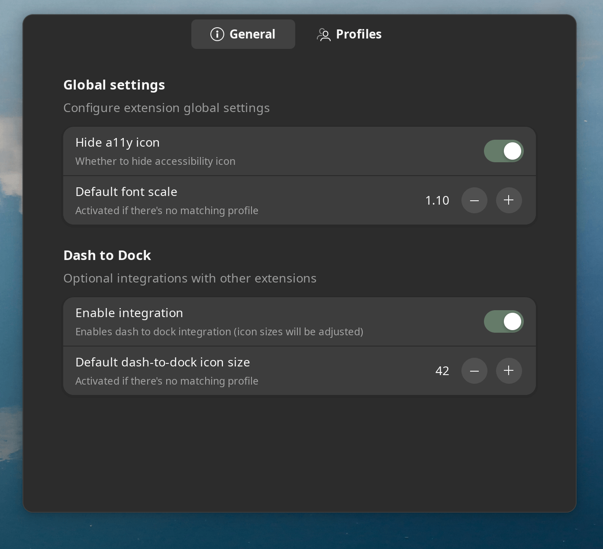
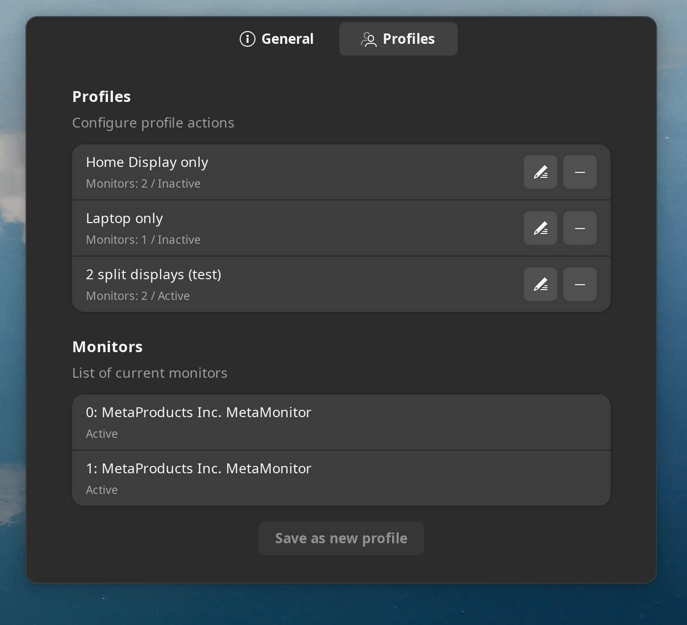
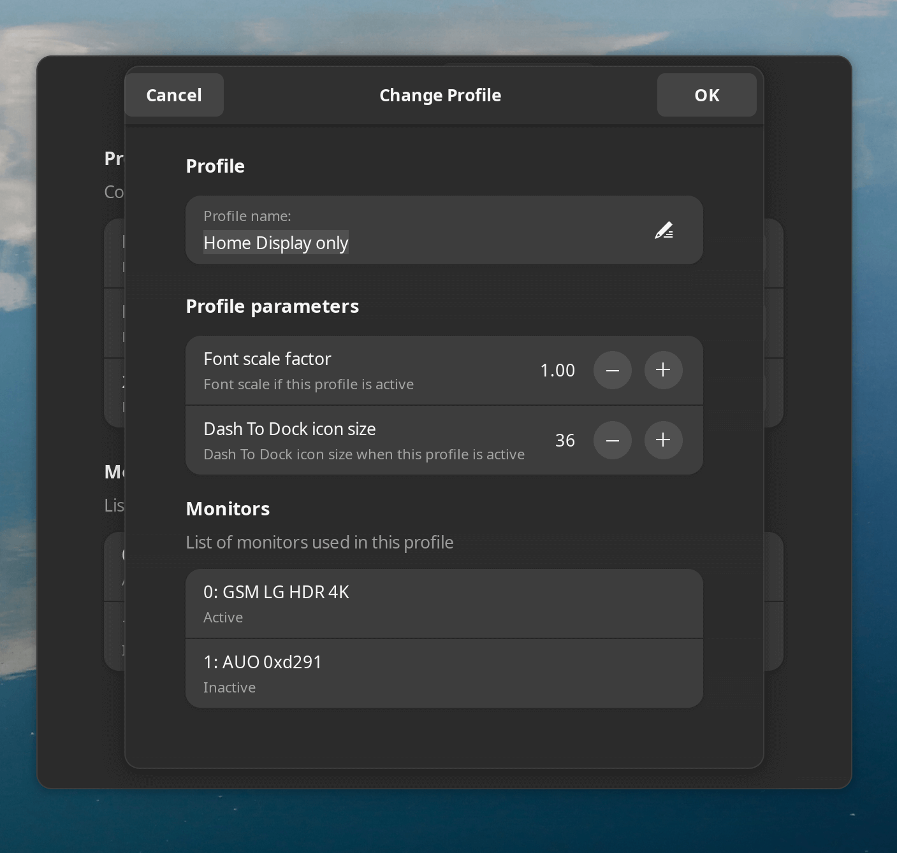

# Scale by Display

A GNOME Shell extension that helps tune your system settings based on which displays are currently available and active.

Imagine you're using a laptop and frequently connect it to different displays (at home, work, etc.) with varying Display PPIs. Sometimes, the text may appear too small or too large. While fractional scaling could be an option, it doesn't always produce optimal results and may not work well with legacy apps, or it may have rough edges. Instead, you can adjust your font scale modifier as a "good enough" solution to make the text readable again.

This extension automates this process with a nice GUI and Wayland support.

Based on the display configuration, you can automatically:
- Set the font scale factor
- Update Dash to Dock icon size
- Reset to defaults for unknown profiles

Additionally, this extension can hide the accessibility icon to reduce clutter.

Currently, this extension is in "alpha" stage but works well in multiple setups I use (Debian 13 and Ubuntu 22.04 on multiple machines). Feedback and bug reports are welcomed.

## Installation

### Manual
```(bash)
wget https://github.com/ilya-m32/scale-by-display/releases/download/v0.2.0/scale-by-display.zip
gnome-extensions install --force scale-by-display.zip
```


### Extension store
gnome-shell extensions: [go here](https://extensions.gnome.org/extension/8256/scale-by-display/) (publishing is WIP)

## Screenshots







## Future plans

These features are currently not supported but may be added in the future:
- "Flexible" profiles, allowing partial matches
- Manual profile creation
- Profile export/import via GUI or an easy script for syncing between devices
